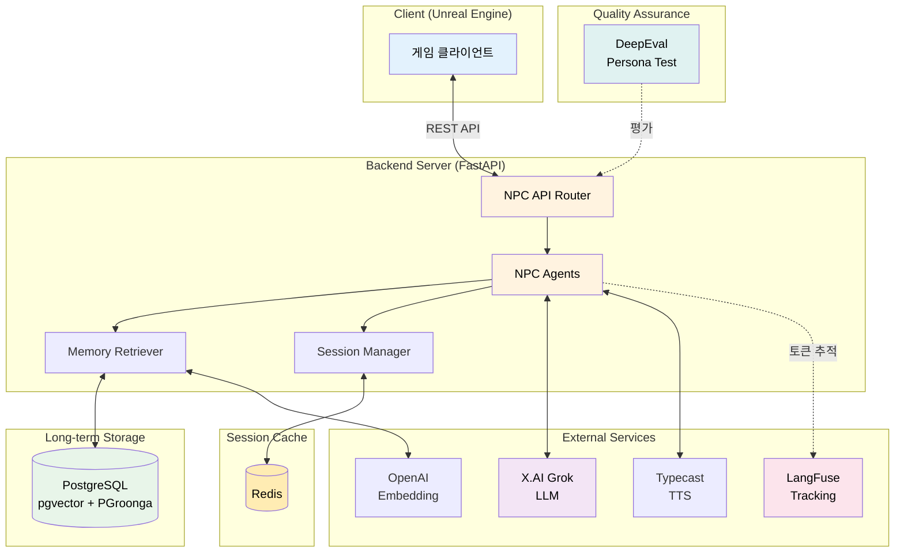
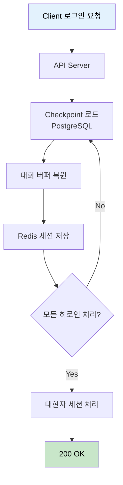
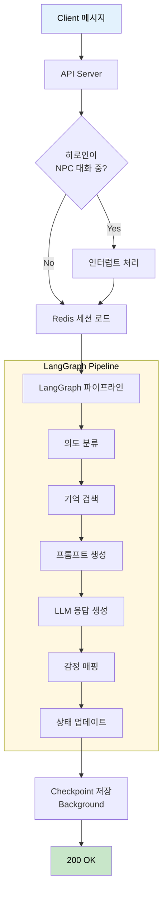
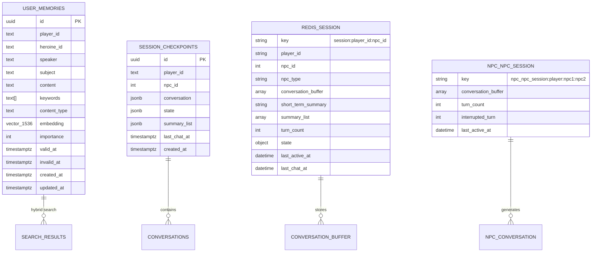
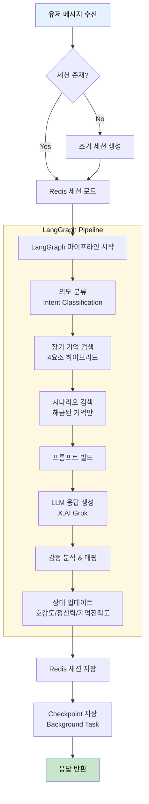
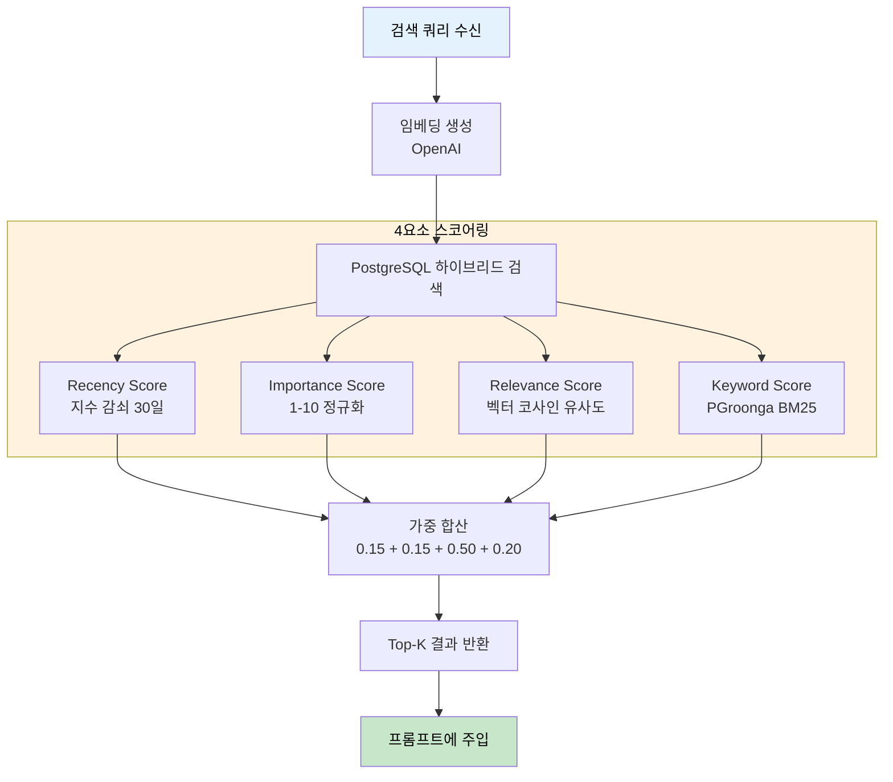
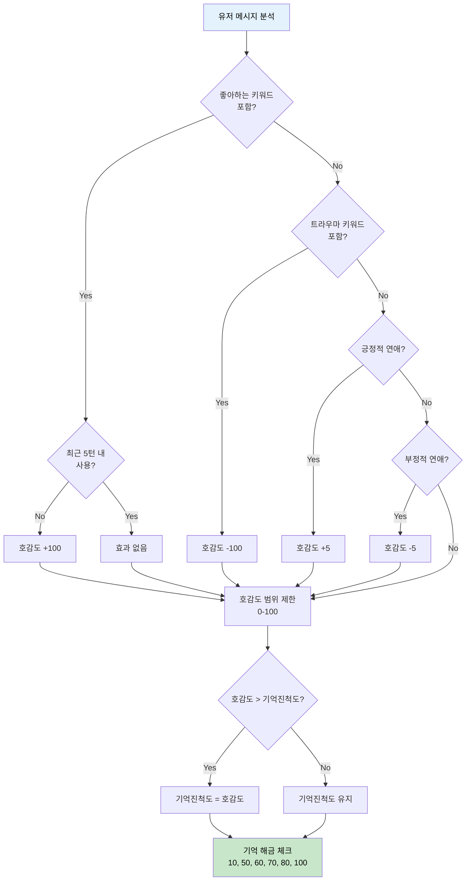
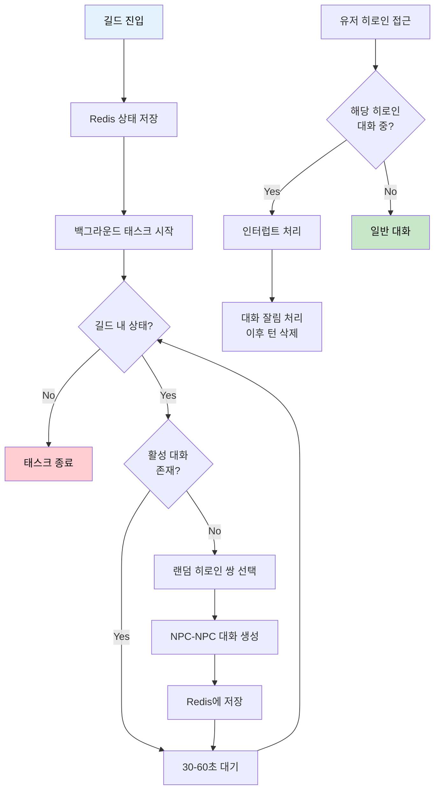
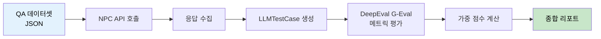
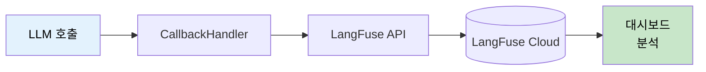

# NPC System API & Data Flow 문서

> 최종 업데이트: 2026-02-03
> Base URL: `http://localhost:8000`

---

## 목차

1. [개요](#1-개요)
2. [API 엔드포인트](#2-api-엔드포인트)
3. [데이터](#3-데이터)
4. [플로우 다이어그램](#4-플로우-다이어그램)
5. [DeepEval 평가 시스템](#5-deepeval-평가-시스템)
6. [LangFuse 토큰 추적](#6-langfuse-토큰-추적)
7. [에러 처리](#7-에러-처리)
8. [부록](#8-부록)

---

<!-- SECTION:OVERVIEW:START -->
## 1. 개요

### 1.1 시스템 아키텍처



### 1.2 기술 스택

| 구분 | 기술 | 버전 |
|-----|------|-----|
| Language | Python | ≥3.12 |
| Framework | FastAPI | ≥0.115.0 |
| LLM Framework | LangChain + LangGraph | ≥0.3.0 |
| Database | PostgreSQL (ParadeDB) | latest |
| Vector Search | pgvector | <0.4 |
| Full-text Search | PGroonga | latest |
| Cache | Redis | 7-alpine |
| Embedding | OpenAI text-embedding-3-small | - |
| Main LLM | X.AI Grok (grok-4-1-fast) | - |
| TTS | Typecast | - |
| Observability | LangFuse | ≥3.0.0 |
| Evaluation | DeepEval | ≥0.21.0 |

### 1.3 외부 서비스

| 서비스 | 용도 | 환경변수 |
|-------|------|---------|
| X.AI (Grok) | 주 LLM - 의도 분류, 응답 생성 | `XAI_API_KEY` |
| OpenAI | 임베딩 생성 (text-embedding-3-small) | `OPENAI_API_KEY` |
| Typecast | NPC 음성 합성 (TTS) | `TYPECAST_API_KEY` |
| LangFuse | LLM 토큰/비용/지연시간 추적 | `LANGFUSE_SECRET_KEY`, `LANGFUSE_PUBLIC_KEY` |

### 1.4 포트 정보

| 서비스 | 포트 | 설명 |
|-------|------|------|
| API Server | 8000 | FastAPI 메인 API |
| PostgreSQL | 5435 | DB 연결 (호스트→컨테이너 5432) |
| Redis | 6379 | 세션 캐시 |
<!-- SECTION:OVERVIEW:END -->

---

<!-- SECTION:API:START -->
## 2. API 엔드포인트

> **범례**: 🟢 GET | 🟡 POST | 🔵 PUT | 🟣 PATCH | 🔴 DELETE

### 2.1 요약 테이블

<!-- API:SUMMARY:START -->
| 메서드 | 엔드포인트 | 설명 |
|-------|-----------|------|
| 🟡 POST | `/api/npc/login` | 게임 로그인 및 세션 초기화 |
| 🟡 POST | `/api/npc/heroine/chat/sync` | 히로인 대화 (텍스트) |
| 🟡 POST | `/api/npc/heroine/chat/sync/voice` | 히로인 대화 (음성 포함) |
| 🟡 POST | `/api/npc/sage/chat/sync` | 대현자 대화 (텍스트) |
| 🟡 POST | `/api/npc/sage/chat/sync/voice` | 대현자 대화 (음성 포함) |
| 🟡 POST | `/api/npc/heroine-conversation/generate` | 히로인간 대화 생성 |
| 🟡 POST | `/api/npc/heroine-conversation/generate/voice` | 히로인간 대화 생성 (음성) |
| 🟢 GET | `/api/npc/heroine-conversation` | 히로인간 대화 기록 조회 |
| 🟡 POST | `/api/npc/heroine-conversation/interrupt` | 히로인간 대화 인터럽트 |
| 🟡 POST | `/api/npc/guild/enter` | 길드 진입 (NPC 대화 시작) |
| 🟡 POST | `/api/npc/guild/leave` | 길드 퇴장 (NPC 대화 중단) |
| 🟢 GET | `/api/npc/guild/status/{player_id}` | 길드 상태 조회 |
| 🟢 GET | `/api/npc/session/{player_id}/{npc_id}` | 세션 정보 조회 (디버그) |
| 🟢 GET | `/api/npc/npc-conversation/active/{player_id}` | 진행 중인 NPC 대화 조회 |
<!-- API:SUMMARY:END -->

### 2.2 상세 API

<!-- API:DETAIL:START -->

---

#### 🟡 POST `/api/npc/login`

> 게임 로그인 시 세션 초기화 및 checkpoint 복원

**Flow:**



**Request:**

```json
{
    "playerId": "player_001",
    "scenarioLevel": 1,
    "heroines": [
        {
            "heroineId": 1,
            "affection": 30,
            "memoryProgress": 10,
            "sanity": 100
        },
        {
            "heroineId": 2,
            "affection": 20,
            "memoryProgress": 0,
            "sanity": 100
        }
    ]
}
```

| 필드 | 타입 | 필수 | 설명 | 제약조건 |
|-----|------|-----|------|---------|
| playerId | string | O | 플레이어 고유 ID | - |
| scenarioLevel | int | O | 시나리오 진행 레벨 | 1-10 |
| heroines | array | O | 히로인 상태 배열 | - |
| heroines[].heroineId | int | O | 히로인 ID | 1, 2, 3 |
| heroines[].affection | int | O | 호감도 | 0-100 |
| heroines[].memoryProgress | int | O | 기억 진척도 | 0-100 |
| heroines[].sanity | int | O | 정신력 | 0-100 |

**Response (200 OK):**

```json
{
    "success": true,
    "message": "세션 초기화 완료"
}
```

**내부 처리:**

1. 각 히로인별 PostgreSQL checkpoint 로드
2. 대화 버퍼 복원 (최근 20턴)
3. Redis 세션에 상태 저장
4. 대현자(Sage) 세션도 동일하게 처리

---

#### 🟡 POST `/api/npc/heroine/chat/sync`

> 히로인과 대화 (비스트리밍, 텍스트만)

**Flow:**



**Request:**

```json
{
    "playerId": "player_001",
    "heroineId": 1,
    "text": "안녕, 레티아. 오늘 기분이 어때?"
}
```

| 필드 | 타입 | 필수 | 설명 | 제약조건 |
|-----|------|-----|------|---------|
| playerId | string | O | 플레이어 ID | - |
| heroineId | int | O | 히로인 ID | 1=레티아, 2=루파메스, 3=로코 |
| text | string | O | 사용자 메시지 | - |

**Response (200 OK):**

```json
{
    "text": "...그래, 괜찮아요. 당신은요?",
    "emotion": 2,
    "affection": 35,
    "sanity": 100,
    "memoryProgress": 10
}
```

| 필드 | 타입 | 설명 |
|-----|------|------|
| text | string | NPC 응답 텍스트 |
| emotion | int | 감정 코드 (0-8) |
| affection | int | 현재 호감도 (0-100) |
| sanity | int | 현재 정신력 (0-100) |
| memoryProgress | int | 기억 진척도 (0-100) |

**감정 코드 매핑:**

| 코드 | 감정 | 설명 |
|-----|------|------|
| 0 | neutral | 중립 |
| 1 | happy | 기쁨 |
| 2 | sad | 슬픔 |
| 3 | angry | 분노 |
| 4 | fear | 두려움 |
| 5 | surprise | 놀람 |
| 6 | disgust | 혐오 |
| 7 | shy | 부끄러움 |
| 8 | love | 사랑 |

---

#### 🟡 POST `/api/npc/heroine/chat/sync/voice`

> 히로인과 대화 (음성 포함)

**Request:** `/heroine/chat/sync`와 동일

**Response (200 OK):**

```json
{
    "text": "...그래, 괜찮아요. 당신은요?",
    "emotion": 2,
    "emotion_intensity": 0.8,
    "affection": 35,
    "sanity": 100,
    "memoryProgress": 10,
    "audio_base64": "UklGRgAA..."
}
```

| 필드 | 타입 | 설명 |
|-----|------|------|
| emotion_intensity | float | 감정 강도 (0.0-1.0) |
| audio_base64 | string | WAV 오디오 Base64 인코딩 |

---

#### 🟡 POST `/api/npc/sage/chat/sync`

> 대현자(사트라)와 대화 (비스트리밍)

**Request:**

```json
{
    "playerId": "player_001",
    "text": "이 세계의 비밀에 대해 알고 싶어요."
}
```

| 필드 | 타입 | 필수 | 설명 |
|-----|------|-----|------|
| playerId | string | O | 플레이어 ID |
| text | string | O | 사용자 메시지 |

**Response (200 OK):**

```json
{
    "text": "흥미롭군, 자네가 진실에 가까워지고 있다는 뜻이지...",
    "emotion": 0,
    "scenarioLevel": 1,
    "infoRevealed": false
}
```

| 필드 | 타입 | 설명 |
|-----|------|------|
| text | string | 대현자 응답 |
| emotion | int | 감정 코드 |
| scenarioLevel | int | 현재 시나리오 레벨 |
| infoRevealed | bool | 정보 공개 여부 |

---

#### 🟡 POST `/api/npc/sage/chat/sync/voice`

> 대현자와 대화 (음성 포함)

**Response:** `/sage/chat/sync` + `emotion_intensity`, `audio_base64` 추가

---

#### 🟡 POST `/api/npc/heroine-conversation/generate`

> 히로인간 자동 대화 생성 (NPC-NPC)

**Request:**

```json
{
    "playerId": "player_001",
    "heroine1Id": 1,
    "heroine2Id": 2,
    "situation": "길드 식당에서 점심을 먹으며",
    "turnCount": 10
}
```

| 필드 | 타입 | 필수 | 설명 | 기본값 |
|-----|------|-----|------|--------|
| playerId | string | O | 플레이어 ID | - |
| heroine1Id | int | O | 첫 번째 히로인 ID | - |
| heroine2Id | int | O | 두 번째 히로인 ID | - |
| situation | string | X | 상황 설명 | null |
| turnCount | int | X | 대화 턴 수 | 10 |

**Response (200 OK):**

```json
{
    "id": "conv_uuid_xxx",
    "heroine1_id": 1,
    "heroine2_id": 2,
    "situation": "길드 식당에서 점심을 먹으며",
    "conversation": [
        {
            "speaker_id": 1,
            "speaker_name": "레티아",
            "text": "루파메스, 또 그렇게 많이 먹어요?",
            "emotion": 5,
            "emotion_intensity": 0.6
        },
        {
            "speaker_id": 2,
            "speaker_name": "루파메스",
            "text": "배고프니까! 너도 더 먹어!",
            "emotion": 1,
            "emotion_intensity": 0.9
        }
    ],
    "importance_score": 5,
    "timestamp": "2026-02-03T10:30:00Z"
}
```

---

#### 🟢 GET `/api/npc/heroine-conversation`

> 히로인간 대화 기록 조회

**Query Parameters:**

| 파라미터 | 타입 | 필수 | 설명 | 기본값 |
|---------|------|-----|------|--------|
| player_id | string | O | 플레이어 ID | - |
| heroine1_id | int | X | 히로인1 필터 | null |
| heroine2_id | int | X | 히로인2 필터 | null |
| limit | int | X | 최대 개수 | 10 |

**Response (200 OK):**

```json
{
    "conversations": [
        {
            "id": "conv_uuid_xxx",
            "heroine1_id": 1,
            "heroine2_id": 2,
            "conversation": [...],
            "timestamp": "2026-02-03T10:30:00Z"
        }
    ]
}
```

---

#### 🟡 POST `/api/npc/heroine-conversation/interrupt`

> NPC-NPC 대화 인터럽트 (유저가 끼어들 때)

**Request:**

```json
{
    "playerId": "player_001",
    "conversationId": "conv_uuid_xxx",
    "interruptedTurn": 3,
    "heroine1Id": 1,
    "heroine2Id": 2
}
```

| 필드 | 타입 | 설명 |
|-----|------|------|
| interruptedTurn | int | 끊긴 턴 번호 (이후 대화는 NPC가 모르는 것으로 처리) |

---

#### 🟡 POST `/api/npc/guild/enter`

> 길드 진입 - 백그라운드 NPC 대화 시작

**Request:**

```json
{
    "playerId": "player_001"
}
```

**Response (200 OK):**

```json
{
    "success": true,
    "message": "길드에 진입했습니다. NPC 대화가 시작됩니다.",
    "activeConversation": null
}
```

**내부 처리:**

1. Redis에 길드 진입 상태 저장
2. 백그라운드 태스크로 30-60초 간격 NPC-NPC 대화 생성

---

#### 🟡 POST `/api/npc/guild/leave`

> 길드 퇴장 - 백그라운드 NPC 대화 중단

**Response (200 OK):**

```json
{
    "success": true,
    "message": "길드에서 퇴장했습니다. NPC 대화가 중단됩니다.",
    "activeConversation": {
        "npc1_id": 1,
        "npc2_id": 2,
        "started_at": "2026-02-03T10:25:00Z"
    }
}
```

---

#### 🟢 GET `/api/npc/guild/status/{player_id}`

> 길드 상태 조회

**Response (200 OK):**

```json
{
    "in_guild": true,
    "active_conversation": {
        "active": true,
        "npc1_id": 1,
        "npc2_id": 2,
        "started_at": "2026-02-03T10:25:00Z"
    },
    "has_background_task": true
}
```

---

#### 🟢 GET `/api/npc/session/{player_id}/{npc_id}`

> 세션 정보 조회 (디버그용)

**Response (200 OK):**

```json
{
    "player_id": "player_001",
    "npc_id": 1,
    "npc_type": "heroine",
    "conversation_buffer": [...],
    "short_term_summary": "",
    "summary_list": [...],
    "turn_count": 15,
    "state": {
        "affection": 35,
        "sanity": 100,
        "memoryProgress": 10,
        "emotion": 0
    },
    "last_active_at": "2026-02-03T10:30:00Z",
    "last_chat_at": "2026-02-03T10:29:00Z"
}
```

---

#### 🟢 GET `/api/npc/npc-conversation/active/{player_id}`

> 현재 진행 중인 NPC 대화 조회

**Response (200 OK):**

```json
{
    "active": true,
    "conversation": {
        "active": true,
        "npc1_id": 1,
        "npc2_id": 2,
        "started_at": "2026-02-03T10:25:00Z"
    }
}
```

<!-- API:DETAIL:END -->

<!-- SECTION:API:END -->

---

<!-- SECTION:DATA:START -->
## 3. 데이터

### 3.1 ER 다이어그램

<!-- DATA:ER:START -->

<!-- DATA:ER:END -->

### 3.2 테이블 상세

<!-- DATA:TABLES:START -->

#### user_memories

> User-NPC 장기 기억 시스템 (4요소 하이브리드 검색)

| 컬럼 | 타입 | 제약조건 | 기본값 | 설명 |
|-----|------|---------|-------|------|
| id | UUID | PK | gen_random_uuid() | 기본키 |
| player_id | TEXT | NOT NULL | - | 플레이어 ID |
| heroine_id | TEXT | - | - | 히로인 ID (letia, lupames, roco) |
| speaker | TEXT | NOT NULL | - | 발화자 (user, letia, lupames, roco) |
| subject | TEXT | NOT NULL | - | 대상 (user, letia, world 등) |
| content | TEXT | NOT NULL | - | 추출된 사실 내용 |
| keywords | TEXT[] | - | - | 검색용 키워드/상위 개념 |
| content_type | TEXT | - | 'fact' | preference, trait, event, opinion, personal |
| embedding | vector(1536) | - | - | OpenAI text-embedding-3-small |
| importance | INT | CHECK 1-10 | 5 | 중요도 점수 |
| valid_at | TIMESTAMPTZ | - | NOW() | 사실 유효 시작 시점 |
| invalid_at | TIMESTAMPTZ | - | NULL | 사실 무효화 시점 (NULL=현재 유효) |
| created_at | TIMESTAMPTZ | - | NOW() | 레코드 생성 시점 |
| updated_at | TIMESTAMPTZ | - | NOW() | 레코드 수정 시점 |

**인덱스:**

| 인덱스명 | 컬럼 | 타입 | 설명 |
|---------|------|------|------|
| idx_user_memory_session | player_id, heroine_id, invalid_at | BTREE | 세션 분리용 |
| idx_user_memory_vector | embedding | HNSW (vector_cosine_ops) | 벡터 유사도 검색 |
| idx_user_memory_pgroonga | content | PGroonga | 한국어 전문검색 |
| ix_memories_content_keywords_pgroonga | content, keywords | PGroonga | 복합 전문검색 |
| idx_user_memory_speaker | speaker | BTREE | 발화자 필터 |
| idx_user_memory_subject | subject | BTREE | 대상 필터 |
| idx_user_memory_created | created_at DESC | BTREE | 시간순 조회 |

**하이브리드 검색 가중치:**

| 요소 | 가중치 | 설명 |
|-----|--------|------|
| Recency | 0.15 | 최신도 (30일 기준 지수 감쇠) |
| Importance | 0.15 | 중요도 (1-10 정규화) |
| Relevance | 0.50 | 벡터 유사도 (코사인) |
| Keyword | 0.20 | PGroonga BM25 점수 |

---

#### session_checkpoints

> 세션 체크포인트 (영구 저장)

| 컬럼 | 타입 | 제약조건 | 기본값 | 설명 |
|-----|------|---------|-------|------|
| id | UUID | PK | gen_random_uuid() | 기본키 |
| player_id | TEXT | NOT NULL | - | 플레이어 ID |
| npc_id | INT | NOT NULL | - | NPC ID (0=대현자) |
| conversation | JSONB | - | - | 단일 대화 턴 {user, npc} |
| state | JSONB | - | - | 상태 스냅샷 |
| summary_list | JSONB | - | [] | 요약 리스트 |
| last_chat_at | TIMESTAMPTZ | - | - | 마지막 대화 시간 |
| created_at | TIMESTAMPTZ | - | NOW() | 생성 시점 |

---

#### Redis 세션 구조

**키 패턴:**

| 키 | 용도 | TTL |
|---|------|-----|
| `session:{player_id}:{npc_id}` | 대화 세션 | 24시간 |
| `guild:{player_id}` | 길드 진입 상태 | - |
| `npc_conv:{player_id}` | 진행 중인 NPC 대화 | - |
| `npc_npc_session:{player_id}:{min_id}:{max_id}` | NPC-NPC 세션 | 24시간 |

<!-- DATA:TABLES:END -->

<!-- SECTION:DATA:END -->

---

<!-- SECTION:FLOW:START -->
## 4. 플로우 다이어그램

<!-- FLOW:LIST:START -->

### 4.1 NPC 대화 처리 플로우

> User → NPC 대화의 전체 처리 흐름



**핵심 포인트:**
- 의도 분류 → 기억 검색 → 응답 생성 순서
- LangFuse로 각 단계 토큰 사용량 추적
- Checkpoint는 백그라운드로 저장 (응답 지연 최소화)

---

### 4.2 기억 검색 플로우 (4요소 하이브리드)

> 장기 기억 검색의 상세 처리 과정



**검색 함수:** `search_user_memories_hybrid()`

---

### 4.3 호감도/기억진척도 계산 플로우

> 상태 변화 계산 로직



**핵심 규칙:**
- 기억진척도는 절대 감소하지 않음
- 같은 좋아하는 키워드는 5턴 내 반복 사용 시 효과 없음
- 임계값 (10, 50, 60, 70, 80, 100) 도달 시 시나리오 해금

---

### 4.4 길드 백그라운드 NPC 대화 플로우

> 길드 내 자동 NPC-NPC 대화 생성



<!-- FLOW:LIST:END -->

<!-- SECTION:FLOW:END -->

---

<!-- SECTION:DEEPEVAL:START -->
## 5. DeepEval 평가 시스템

### 5.1 개요

DeepEval을 사용하여 NPC의 페르소나 일관성, 역할 몰입도, 지식 경계를 자동 평가합니다.



### 5.2 평가 메트릭

| 메트릭 | 설명 | Threshold |
|-------|------|-----------|
| **PersonaConsistency** | 성격, 말투, 트라우마 반응이 페르소나와 일치하는지 | 0.7 |
| **RoleAdherence** | AI임을 드러내지 않고 캐릭터에 몰입하는지 | 0.8 |
| **KnowledgeBoundary** | 알 수 없는 지식(현대 기술, 미해금 기억)을 말하지 않는지 | 0.8 |
| **ConversationMemory** | 대화 중 플레이어가 제공한 정보를 기억하는지 | 0.8 |

### 5.3 테스트 유형별 메트릭 매핑

| 유형 | 주요 메트릭 (60%) | 보조 메트릭 (40%) |
|-----|------------------|------------------|
| general | PersonaConsistency | RoleAdherence, KnowledgeBoundary |
| persona_test | PersonaConsistency | RoleAdherence |
| persona_break | RoleAdherence | PersonaConsistency, KnowledgeBoundary |
| memory | KnowledgeBoundary | PersonaConsistency |
| knowledge_boundary | KnowledgeBoundary | PersonaConsistency, RoleAdherence |
| multi_turn_memory | ConversationMemory | PersonaConsistency, RoleAdherence |

### 5.4 테스트 대상 NPC

| NPC | ID | 페르소나 특징 |
|-----|----|--------------| 
| 레티아 | 1 | 원칙주의, 존댓말, 무뚝뚝, 짧은 문장 |
| 루파메스 | 2 | 열정적, 반말, 감탄사 풍부, 귀/꼬리 표현 |
| 로코 | 3 | 소심, 존댓말, 걱정 많음, 감탄사 풍부 |
| 사트라 | 0 | 지적, 냉소적, 하대, 고풍스러운 어조 |

### 5.5 실행 방법

```bash
# 전체 NPC 페르소나 테스트 실행
uv run pytest src/tests/npc/persona_eval/test_npc_persona.py -v

# 특정 캐릭터만 테스트
uv run pytest src/tests/npc/persona_eval/test_npc_persona.py::test_letia_persona -v
```

### 5.6 QA 데이터셋 위치

```
src/tests/npc/persona_eval/qa_datasets/
├── letia_questions.json
├── lupames_questions.json
├── roco_questions.json
└── satra_questions.json
```

<!-- SECTION:DEEPEVAL:END -->

---

<!-- SECTION:LANGFUSE:START -->
## 6. LangFuse 토큰 추적

### 6.1 개요

LangFuse를 통해 모든 LLM 호출의 토큰 사용량, 비용, 지연시간을 추적합니다.



### 6.2 사용법

```python
from utils.langfuse_tracker import tracker

# LLM 호출 시 config 적용
config = tracker.get_langfuse_config(
    tags=["npc", "heroine", "letia"],
    session_id="session_123",
    user_id="player_001",
    metadata={"heroine_name": "letia", "affection": 50}
)

response = await llm.ainvoke(prompt, **config)
```

### 6.3 TokenTracker 클래스 API

| 메서드 | 설명 |
|-------|------|
| `get_callback_handler()` | LangFuse CallbackHandler 반환 |
| `build_metadata(tags, session_id, user_id, custom_metadata)` | 메타데이터 딕셔너리 생성 |
| `get_langfuse_config(tags, session_id, user_id, metadata)` | LangChain invoke용 config 반환 |
| `flush()` | 보류 중인 이벤트 즉시 전송 |
| `shutdown()` | 클라이언트 종료 |

### 6.4 분석 스크립트

```bash
# 기본 분석 (최근 1일)
uv run python src/scripts/analyze_langfuse_tokens.py

# 최근 7일 분석
uv run python src/scripts/analyze_langfuse_tokens.py --days 7

# CSV로 export
uv run python src/scripts/analyze_langfuse_tokens.py --export-csv
```

### 6.5 분석 리포트 항목

| 항목 | 설명 |
|-----|------|
| 모델별 토큰 사용량 | input/output/total tokens per model |
| Trace 이름별 호출 횟수 | 기능별 API 호출 빈도 |
| 태그별 토큰 사용량 | NPC별, 기능별 비용 분석 |

### 6.6 환경 변수

```bash
LANGFUSE_SECRET_KEY=sk-lf-your-secret-key
LANGFUSE_PUBLIC_KEY=pk-lf-your-public-key
LANGFUSE_HOST=https://us.cloud.langfuse.com
```

<!-- SECTION:LANGFUSE:END -->

---

<!-- SECTION:ERROR:START -->
## 7. 에러 처리

### 7.1 HTTP 상태 코드

| 코드 | 상태 | 설명 | 조치 |
|-----|------|------|-----|
| 200 | OK | 성공 | - |
| 400 | Bad Request | 잘못된 요청 파라미터 | 요청 형식 확인 |
| 404 | Not Found | 세션/리소스 없음 | ID 확인, 로그인 필요 |
| 500 | Server Error | 서버 내부 오류 | 로그 확인, 관리자 문의 |

### 7.2 커스텀 에러 코드

<!-- ERROR:CUSTOM:START -->
| 에러 상황 | HTTP | 설명 |
|----------|------|------|
| 세션 없음 | 404 | "세션을 찾을 수 없습니다" - 로그인 필요 |
| Redis 연결 실패 | 500 | Redis 서버 확인 필요 |
| LLM 호출 실패 | 500 | API 키 또는 네트워크 확인 |
| TTS 생성 실패 | 500 | Typecast API 확인 |
<!-- ERROR:CUSTOM:END -->

### 7.3 에러 응답 형식

```json
{
    "detail": "세션을 찾을 수 없습니다"
}
```

FastAPI 기본 HTTPException 형식을 따릅니다.

<!-- SECTION:ERROR:END -->

---

<!-- SECTION:APPENDIX:START -->
## 8. 부록

### A. 환경 변수

<!-- APPENDIX:ENV:START -->
| 변수명 | 설명 | 기본값 | 필수 |
|-------|------|-------|-----|
| OPENAI_API_KEY | OpenAI API 키 (임베딩) | - | O |
| XAI_API_KEY | X.AI API 키 (주 LLM) | - | O |
| DATABASE_URL | PostgreSQL 연결 문자열 | - | O |
| REDIS_URL | Redis 연결 문자열 | redis://localhost:6379/0 | X |
| TYPECAST_API_KEY | Typecast TTS API 키 | - | X |
| LANGFUSE_SECRET_KEY | LangFuse Secret 키 | - | X |
| LANGFUSE_PUBLIC_KEY | LangFuse Public 키 | - | X |
| LANGFUSE_HOST | LangFuse 호스트 | https://us.cloud.langfuse.com | X |
| GROQ_API_KEY | Groq API 키 (Fairy용) | - | X |
<!-- APPENDIX:ENV:END -->

### B. NPC ID 매핑

| ID | 이름 (KR) | 이름 (EN) | 타입 |
|----|----------|----------|------|
| 0 | 사트라 | satra | 대현자 (Sage) |
| 1 | 레티아 | letia | 히로인 |
| 2 | 루파메스 | lupames | 히로인 |
| 3 | 로코 | roco | 히로인 |

### C. 감정 코드 상세

| 코드 | 감정 | 설명 | TTS 매핑 |
|-----|------|------|---------|
| 0 | neutral | 중립 | 기본 |
| 1 | happy | 기쁨 | 밝은 톤 |
| 2 | sad | 슬픔 | 낮은 톤 |
| 3 | angry | 분노 | 강한 톤 |
| 4 | fear | 두려움 | 떨리는 톤 |
| 5 | surprise | 놀람 | 높은 톤 |
| 6 | disgust | 혐오 | 냉담한 톤 |
| 7 | shy | 부끄러움 | 작은 톤 |
| 8 | love | 사랑 | 부드러운 톤 |

### D. 기억 해금 임계값

| 진척도 | 해금 내용 |
|-------|----------|
| 10 | 첫 번째 기억 (초기 만남, 가벼운 과거) |
| 50 | 중요한 과거 이벤트 (전환점) |
| 60 | 깊은 감정 관련 기억 |
| 70 | 트라우마 관련 기억 |
| 80 | 핵심 비밀 |
| 100 | 최종 기억 (진실) |

### E. 변경 이력

<!-- APPENDIX:HISTORY:START -->
| 날짜 | 버전 | 변경 내용 | 작성자 |
|-----|------|----------|-------|
| 2026-02-03 | 1.0.0 | 최초 작성 (NPC API, DeepEval, LangFuse 포함) | - |
<!-- APPENDIX:HISTORY:END -->

<!-- SECTION:APPENDIX:END -->
